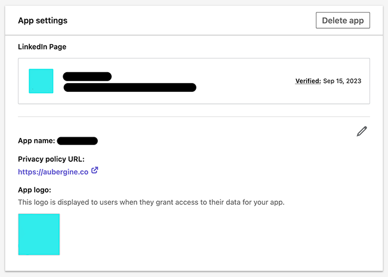
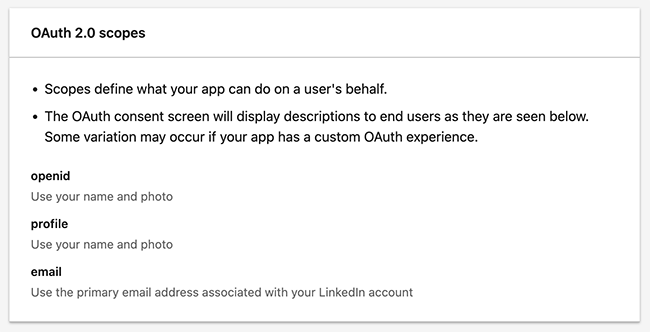
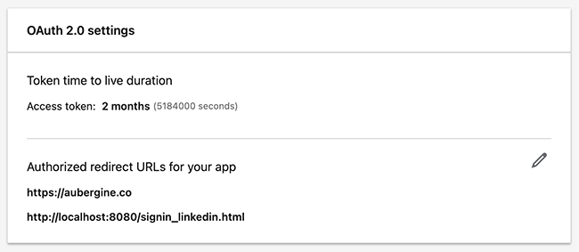

# Sign In With LinkedIn

A Flutter package that helps to **Sign in with LinkedIn**.

Web support is limited to getting authorization code. HTTP requests are not supported due to CORS restrictions. see more details in [CORS Limitation in the Web](#cors-limitations-in-the-web).

## Overview

- This package uses the `v2` flow of Sign in - [Sign In with LinkedIn using OpenID Connect] as the old flow of [Sign In with LinkedIn] has been deprecated.

Other documentation:
- [3-legged & 2-legged OAuth Flow]
- [Getting Access to LinkedIn APIs]

## Getting Started

- You must have a **LinkedIn account** with a **company page**, as it is required to create and verify your app. [Create a company page] if you don't have one.
- Login to the [LinkedIn Developer Portal] to create an app.

### Create an App on LinkedIn

- Go to [My Apps] and click on Create app.
- Verify your app by clicking on the verification link while logged into your company's LinkedIn account.
- Refresh the `Settings` tab—you should see `Verified` along with the verification date in the app settings.

Refer to the app settings screenshots below:



### Enable Products

This section is about determining the data your app requires and enabling the appropriate products accordingly.

In the `Products` tab, Request access for `Sign In with LinkedIn using OpenID Connect`. This is primarily required for user authentication and retrieving profile details.

After that, go to the Auth tab and refresh the page. You will see the updated scopes under `OAuth 2.0 scopes`.



You will see additional scopes, such as `w_member_social`, along with `openid, profile, email` if you have enabled other products.

> Only the scopes listed under `OAuth 2.0 scopes` can be used in the app.

### Add Redirect URLs

This is the URL where the user will be redirected after successfully authenticating with LinkedIn. Upon redirection, LinkedIn appends the authorization code to the query parameters.

On platforms other than the web, any HTTP/HTTPS URL will work. However, for the web, a specific code snippet in the HTML page is required to handle the callback and pass the authorization code to Dart.



## Web Implementation

Web platform requires specific setup to obtain the authorization code.

### Setup Redirect URL

For the web platform, you need to add a specific code snippet to your HTML page to handle the callback and pass the authorization code to Dart.

If you have your own hosted page, you can insert the following script inside the `<head>` tag.

```html
<head>
  ...
  <script>
    window.opener.postMessage(window.location.href, '*');
</script>
  ...
</head>
```
If not, you can create a file inside the web folder of your Flutter project, such as [`signin_linkedin.html`]. with this file, you must set your localhost URL as the redirect URL:

```
http://localhost:8080/signin_linkedin.html
```

To ensure this URL works consistently, set the localhost port to `8080` in your run configurations using `--web-port=8080`. Alternatively, run the app with the following command:

```sh
flutter run -d chrome --web-port=8080
```

## CORS Limitations in the Web

As mentioned above, the web cannot make direct HTTP requests to LinkedIn domains due to `CORS` restrictions. 

The recommended approach is to obtain the authorization code using the `getAuthorizationCode()` method, send it to your backend to generate an access token, and then make LinkedIn REST API calls from your backend. The web app can then communicate with LinkedIn indirectly by calling your backend APIs.

### Test the flow in the web

This approach is not recommended, but if you still want to test LinkedIn HTTP requests, you can disable web security to bypass CORS limitations and then call `getAccessToken` and `getUserInfo` methods. This is only applicable for localhost and will not work in a **production** environment.

```sh
flutter run -d chrome --web-port=8080 --web-browser-flag "--disable-web-security"
```

## Code Implementation 👨‍💻

For detailed implementation and usage, refer to the [`example`] project.

### Initialize Configuration

```dart
// Modify the "scope" below as per your need
  final linkedInConfig = LinkedInConfig(
    clientId: '<<CLIENT ID>>',
    clientSecret: '<<CLIENT SECRET>>',
    redirectUrl: '<<REDIRECT URL>>',
    scope: ['openid', 'profile', 'email'],
  );

  final linkedin = SignInWithLinkedIn(config: linkedInConfig);
```

### Get Authorization Code

```dart
final (authCode, error) = await linkedin.getAuthorizationCode(context: context);

if (authCode != null) {
  // Use the authorization code to generate an access token
  log('Authorization code: $authCode');
} else {
  log('Error: ${error?.toJson()}');
}
```

### Get Access Token

Pass the authorization code to the `getAccessToken` method. this method will give you the complete info of access token.

```dart
if (authCode != null && !kIsWeb) {
  final (tokenInfo, error) = await linkedin.getAccessToken(authorizationCode: authCode);

  if (tokenInfo != null) {
    log('Access token data: ${tokenInfo.toJson()}');
  } else {
    log('Error: ${error?.toJson()}');
  }
}
```

### Get User Info

```dart
if (tokenInfo != null && !kIsWeb) {
  final (user, error) = await linkedin.getUserInfo(tokenType: tokenInfo.tokenType, token: tokenInfo.accessToken);

  if (user != null) {
    log('User info: ${user.toJson()}');
  } else {
    log('Error: ${error?.toJson()}');
  }
}
```

This method retrieves the complete user information by calling the `v2/userinfo` endpoint. However, if you are using the **3-legged OAuth flow**, this method will not work. In that case, you need to call the `v2/me` endpoint manually.

### Logout

This method calls the LinkedIn logout URL in a web view, logging you out from your LinkedIn account.

For web, it opens the logout URL in an external window, ensuring that your browser no longer has access to the LinkedIn account, requiring you to log in again.

```dart
await linkedin.logout(context);
```

## Sign in Button

We have not included a predefined Sign in with LinkedIn button or widget. You can design your own UI for the sign-in button.

If needed, you can download the official button image from LinkedIn's [Image Resources].

---

[Sign In with LinkedIn using OpenID Connect]: https://learn.microsoft.com/en-us/linkedin/consumer/integrations/self-serve/sign-in-with-linkedin-v2
[Sign In with LinkedIn]: https://learn.microsoft.com/en-us/linkedin/consumer/integrations/self-serve/sign-in-with-linkedin
[3-legged & 2-legged OAuth Flow]: https://learn.microsoft.com/en-us/linkedin/shared/authentication/authentication
[Getting Access to LinkedIn APIs]: https://learn.microsoft.com/en-us/linkedin/shared/authentication/getting-access?context=linkedin%2Fcontext
[LinkedIn Developer Portal]: https://developer.linkedin.com/
[Create a company page]: https://www.linkedin.com/company/setup/new/
[My Apps]: https://www.linkedin.com/developers/apps
[Image Resources]: https://learn.microsoft.com/en-us/linkedin/consumer/integrations/self-serve/sign-in-with-linkedin-v2#image-resources

[`signin_linkedin.html`]: example/web/signin_linkedin.html
[`example`]: example
